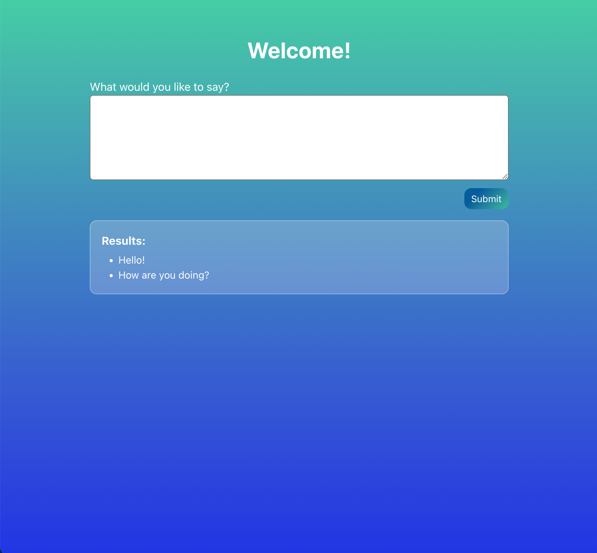

#  Form Submission Project
This project allows a user to type in text, and every time they press the submit button, their text will appear in the screen. 

## Tech used:
* HTML５
* CSS３
* JavaScript
* React

## Features:
* Every time the user clicks submit, their text (a string) is appended onto an array